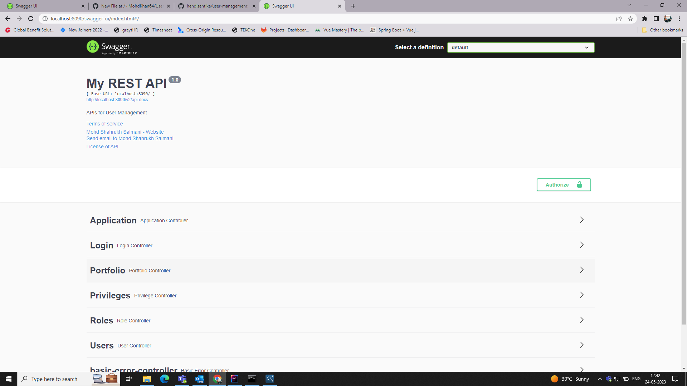

# User_Management
It is a backend for user management with Spring boot and PostgreSQL Database.

## How to run 
1. Clone the repository.
2. Change the application.properties file according to your database port and name.
3. Run the application.
4. First run all the scripts in database.
5. open this url: http://localhost:8090/swagger-ui/index.html  

## Scripts

### CREATE ALL PRIVILEGES
INSERT INTO public.sre_ssp_privilege (created_at, privilege_name, updated_at)
VALUES 
(CURRENT_TIMESTAMP, 'CREATE_PORTFOLIO', CURRENT_TIMESTAMP),
(CURRENT_TIMESTAMP, 'VIEW_PORTFOLIO', CURRENT_TIMESTAMP),
(CURRENT_TIMESTAMP, 'EDIT_PORTFOLIO', CURRENT_TIMESTAMP),
(CURRENT_TIMESTAMP, 'DELETE_PORTFOLIO', CURRENT_TIMESTAMP),
(CURRENT_TIMESTAMP, 'CREATE_APPLICATION', CURRENT_TIMESTAMP),
(CURRENT_TIMESTAMP, 'VIEW_APPLICATION', CURRENT_TIMESTAMP),
(CURRENT_TIMESTAMP, 'EDIT_APPLICATION', CURRENT_TIMESTAMP),
(CURRENT_TIMESTAMP, 'DELETE_APPLICATION', CURRENT_TIMESTAMP),
(CURRENT_TIMESTAMP, 'CREATE_DASHBOARD', CURRENT_TIMESTAMP),
(CURRENT_TIMESTAMP, 'VIEW_DASHBOARD', CURRENT_TIMESTAMP),
(CURRENT_TIMESTAMP, 'EDIT_DASHBOARD', CURRENT_TIMESTAMP),
(CURRENT_TIMESTAMP, 'DELETE_DASHBOARD', CURRENT_TIMESTAMP),
(CURRENT_TIMESTAMP, 'CREATE_ROLE', CURRENT_TIMESTAMP),
(CURRENT_TIMESTAMP, 'VIEW_ROLE', CURRENT_TIMESTAMP),
(CURRENT_TIMESTAMP, 'EDIT_ROLE', CURRENT_TIMESTAMP),
(CURRENT_TIMESTAMP, 'DELETE_ROLE', CURRENT_TIMESTAMP),
(CURRENT_TIMESTAMP, 'CREATE_USER', CURRENT_TIMESTAMP),
(CURRENT_TIMESTAMP, 'VIEW_USER', CURRENT_TIMESTAMP),
(CURRENT_TIMESTAMP, 'EDIT_USER', CURRENT_TIMESTAMP),
(CURRENT_TIMESTAMP, 'DELETE_USER', CURRENT_TIMESTAMP);

### CREATE SUPER_ADMIN ROLE
INSERT INTO public.sre_ssp_role(
	 created_at, role_name, updated_at)
	VALUES (CURRENT_TIMESTAMP, 'SUPER_ADMIN', CURRENT_TIMESTAMP);

### ASSIGN ALL THE PRIVILEGES TO SUPER_ADMIN ROLE
INSERT INTO public.sre_ssp_role_privilege_mapping(privilege_id, role_id)
SELECT id, 1
FROM public.sre_ssp_privilege
WHERE id NOT IN (
    SELECT privilege_id
    FROM public.sre_ssp_role_privilege_mapping
    WHERE role_id = 1
);

### CREATE SUPERADMIN USER
INSERT INTO public.sre_ssp_user(
	created_at, first_name, last_name, password, updated_at, user_email_id)
	VALUES(CURRENT_TIMESTAMP, 'SUPERADMIN', 'SUPERADMIN', '$2a$10$r22/WC5HwJ2kxKxs9M1KouKwLgJnl.if2UokD3hiBtDlw58WTP.vy', CURRENT_TIMESTAMP, 'SUPERADMIN');

### ASSIGN SUPER_ADMIN ROLE TO SUPERADMIN USER
INSERT INTO public.sre_ssp_user_role_mapping(
	user_id, role_id)
	VALUES (1, 1);   

## ScreenShot of Swagger

